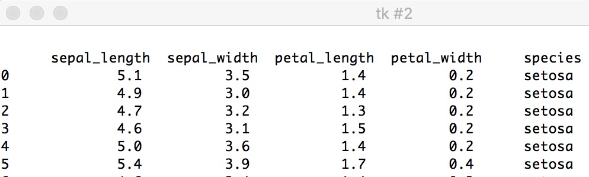
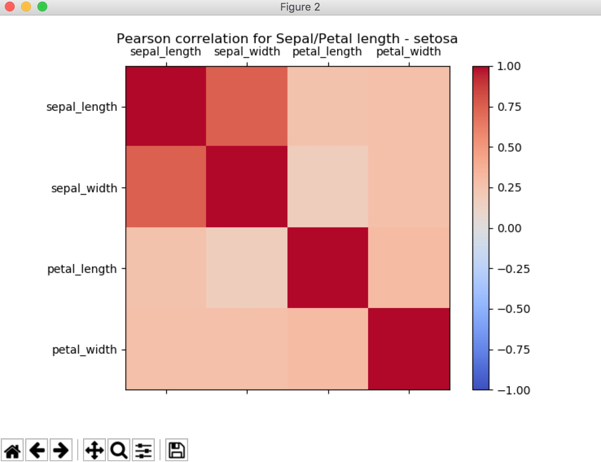
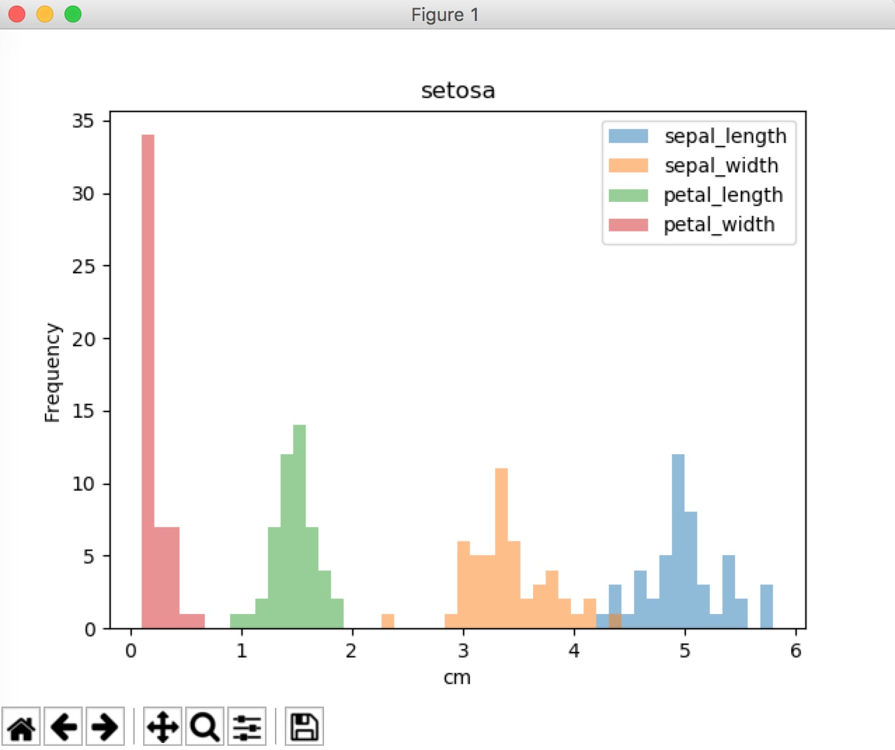
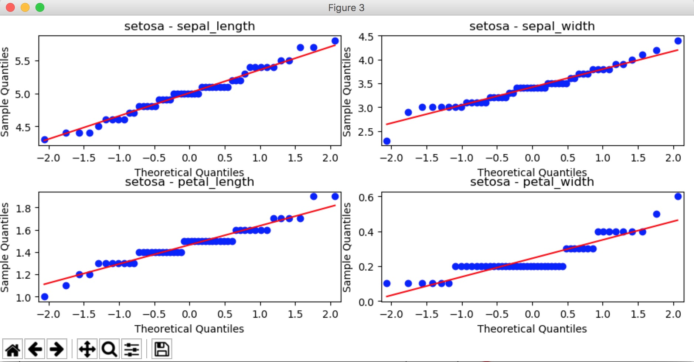
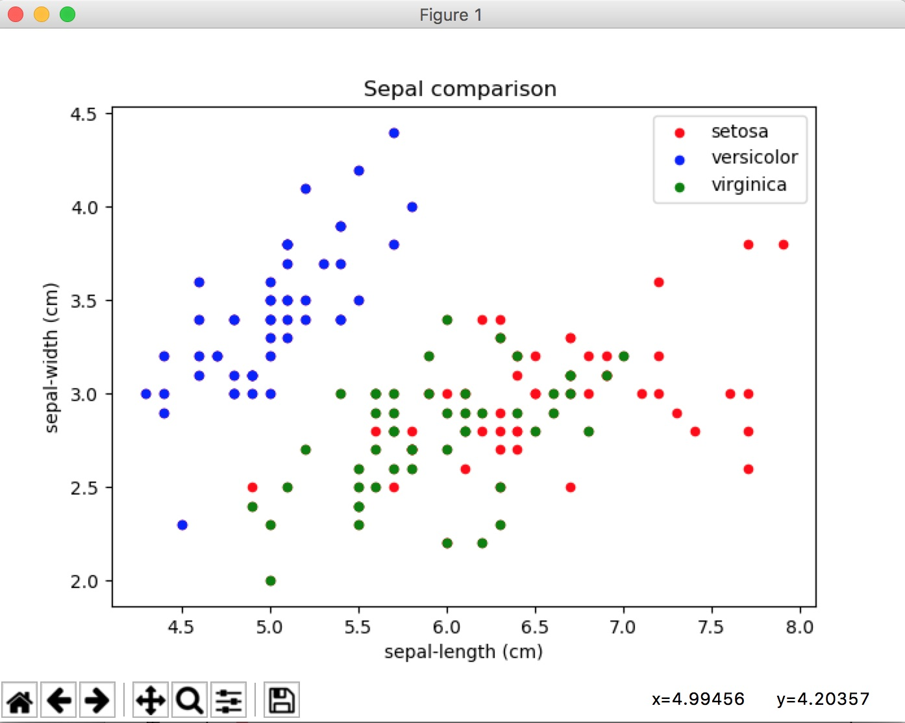

# pands-project
GMIT HDip Data analytics. Programming and Scripting project, semester 1, 2019 

**Introduction**
In 1935 data were collected by researcher Edgar Anderson of the sepal and petal lengths and widths from 50 individual Iris flowers from each of 3 species of plant (Setosa, Versicolor and Virginica), from the Gaspé peninsula of Eastern Canada [1]. In 1936 a paper was published by Roger Fisher exploring methods of disriminant analysis [2] to determine if there were significant differences between the subsets of the data set that could be used to categorize the data. Since then this 'well known' data set has been widely used to test statistical models in the machine learning environment [3].

This project uses a Python program to provide a brief overview of the data set, and basic statistical features of it, via a mixture of graphical presentations and the outputs from probability distribution functions.

A snippet of the first few rows of the data is :

**Method**
A copy of the data set was downloaded from Github [4], and a Python program was written to carry out the following :

Using the Tkinter GUI front end, present the user with a 'button' driven menu to select from the options :

1. Display the whole data set, or the entries for each individual species.
2. Show a summary of the basic statistics of the data set as a whole, and for each species, including :
   mean, standard deviation, variance, minimum and maximum values, and the 25%, 50% (median) and 75% percentiles
   (the values below which the corresponding percentage of the data lie).
   Provide these figures for the 4 categories - sepal length/width, petal length/width
3. Present a coloured display illustrating the correlations between each of the 4 categories of data, for each species
   and for the whole data set. Use the 'matshow' module to obtain this. An example is :
   
4. Show a histogram frequency plot, from 'matplotlib', for each of the data types, for the whole data set, and for each species, eg
      
5. Demonstrate graphically how closely each subset fits the Normal probability distribution using 'qqplot' from
   'statsmodels.graphics.gofplots. eg  
6. Use 3 probability distribution functions to check the 'normality' of the data - Shapiro (scipy.stats.shapiro), 
   Pearson (scipy.stats.normaltest) and Anderson (scipy.stats.anderson).
7. Display scatter graphs for all 3 species of the following characteristics : Sepal length - Sepal width ; 
   Petal length - Petal width ; Petal length - Sepal length; Petal width - Sepal width
   Use matplotlib plot kind="scatter".
   eg.    
8. Show a photo of each species, with labels on one of them to highlight a petal and a sepal. 
   Use matplotlib 'imread' and 'imshow'
9. Provide a summary of the results in a text box
10. Show 'help' text in a text box
11. Allow the user to Quit from the GUI

The following files constitute the project :

iris_dataset.py      -  The python program used to present the data.
                        No run time arguments required, but 'help' can be accepted as an argument
                        Syntax : python iris_dataset.py [help]

irisdata.csv         -  A csv of the actual data (from Github)

Correlation.jpg      -  An example of the output from a correlation plot

Histogram.jpg        -  An example of the output from a histogram plot

NormalPlot.jpg       -  An example of the output from a Normal fit plot

Scatter.jpg          -  An example of the output from a Scatter plot 

Iris_Setosa.jpg      -  A photograph of Iris Setosa [5]

Iris_Versicolor.jpg  -  A photograph of Iris Versicolor [6]

Iris_verginica.jpg   -  A photograph of Iris Virginica [7]

**References**

[1] https://www.academia.edu/13069408/Report_on_Edgar_Anderson_s_Iris_Data_Analysis

[2] https://www.statisticssolutions.com/discriminant-analysis/

[3] https://en.wikipedia.org/wiki/Iris_flower_data_set

[4] https://gist.github.com/curran/a08a1080b88344b0c8a7

[5] http://www.cfgphoto.com/photo-55675.htm

[6] https://commons.wikimedia.org/wiki/File:Iris_versicolor_3.jpg

[7] https://commons.wikimedia.org/wiki/File:Iris_virginica_-_NRCS.jpg
